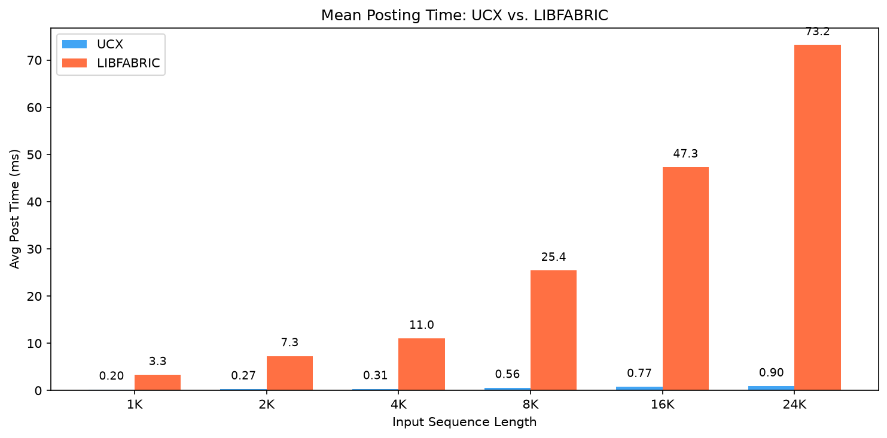
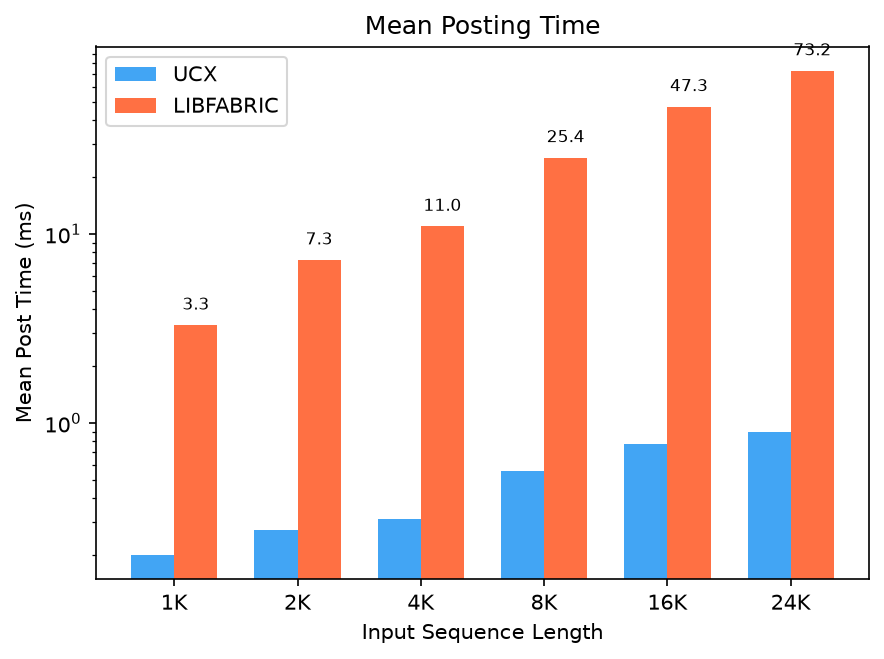
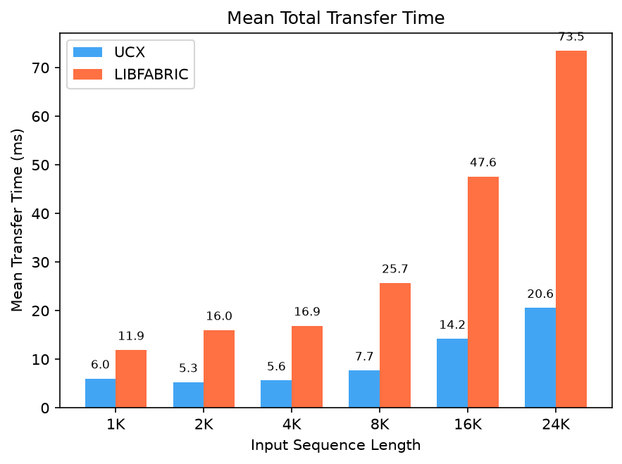
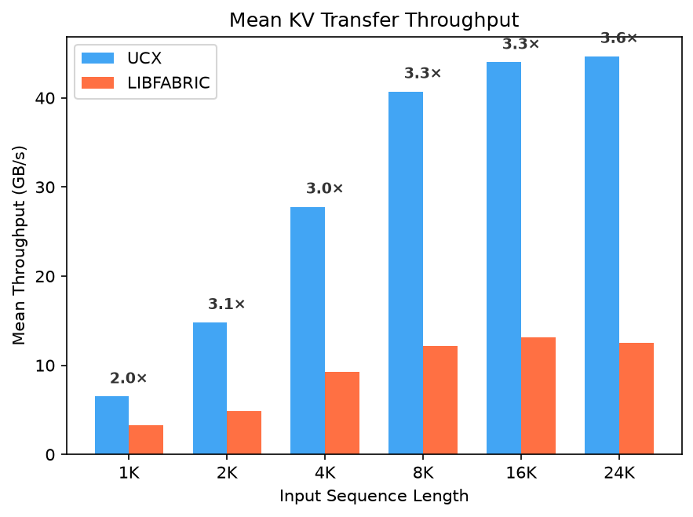

# NIXL KV Transfer: LIBFABRIC Posting Analysis

## 1. The Problem: LIBFABRIC Posting Dominates Transfer Time

During P/D disaggregation benchmarks (Llama-3.3-70B-FP8, 1P+1D TP=8), we observed that LIBFABRIC's (LF) `post_time` consumed nearly all of `xfer_time` — and both grew linearly with input sequence length (ISL). UCX (on IB/RoCE NICs; tested on CoreWeave H200 IB) showed no such behavior.


| ISL    | UCX Post (ms) | UCX Xfer (ms) | LF Post (ms) | LF Xfer (ms) | LF Post/Xfer |
| ------ | ------------- | ------------- | ------------ | ------------ | ------------ |
| 1,024  | 0.20          | 6.02          | 3.3          | 11.9         | 28%          |
| 4,096  | 0.31          | 5.62          | 11.0         | 16.9         | 65%          |
| 8,192  | 0.56          | 7.68          | 25.4         | 25.7         | 99%          |
| 16,384 | 0.77          | 14.21         | 47.3         | 47.6         | 99%          |
| 24,000 | 0.90          | 20.56         | 73.2         | 73.5         | **100%**     |


At ISL=24000, LIBFABRIC spends 73 ms *just posting descriptors*, while UCX posts the same workload in under 1 ms. What's going on inside each backend?

---


## 2. Root Cause: How Each Backend Posts Descriptors

Both backends implement `postXfer()`, which NIXL calls synchronously. In P/D disaggregation, the decode worker pulls KV cache via RDMA READ (`NIXL_READ` → `ucp_get_nbx` / `fi_read`). This is a 1-sided operation — the decode NIC sends a read request over the wire, and the remote NIC DMA-reads from prefill memory and sends the data back.

Both backends iterate per-descriptor with the same NIXL-level work: rail selection, MR handle lookup, and remote key lookup. The divergence is in what happens when the Work Queue Element (WQE) is actually posted to the NIC.

### UCX (IB/RoCE NICs) — `ucx_backend.cpp`

```cpp
sendXferRange(..., start_idx, end_idx) {
    for (size_t i = start_idx; i < end_idx; ++i) {
        // common: rail selection, MR handle, remote key lookup
        ep->read(raddr, rkey, laddr, lmd->mem, lsize, req);
        //  ↑ ucp_get_nbx: writes WQE to host-memory send queue
    }
    ep->flushEp();  // single doorbell rings for entire batch
}
```

`ep->read()` maps to `ucp_get_nbx()` with `UCP_OP_ATTR_FLAG_MULTI_SEND`, enabling **doorbell batching**: WQEs accumulate in the host-memory send queue, and the doorbell (a single MMIO write to the NIC's UAR register) is rung once for the entire batch at `flushEp()`. The NIC then DMA-reads all queued WQEs in one shot.

This explains the **amortization** in the data — per-descriptor cost drops from 0.16 μs (1,280 desc) to 0.03 μs (30,080 desc) because the doorbell MMIO is spread across more WQEs.

Additional optimization available:

- **Thread pool splitting** — `num_threads > 0` chunks the descriptor range across a thread pool


### LIBFABRIC (EFA NICs) — `libfabric_backend.cpp`

```cpp
nixlLibfabricEngine::postXfer(...) {
    for (int desc_idx = 0; desc_idx < desc_count; ++desc_idx) {
        // common: rail selection, MR handle, remote key lookup
        rail_manager_.prepareAndSubmitTransfer(READ, ...);
        //   → rails_[i]->postRead() → fi_read()
    }
}
```

**What** `fi_read` **does:** constructs a WQE as a stack variable, then copies it to **write-combined (WC) NIC memory** (the EFA Low Latency Queue / LLQ) via `mmio_memcpy_x64` — an MMIO-class operation, not a RAM write. Then it rings the **doorbell** via `mmio_write32(sq->wq.db, ...)`. This doorbell is rung **per descriptor**, so each `fi_read` does **two MMIO operations**.

This explains why LIBFABRIC's per-descriptor cost stays constant at ~2.2–2.9 μs — neither the WC copy nor the per-call doorbell amortize with batch size.

> **Note:** Our benchmarks run on NIXL v1.2.0, which includes `FI_MORE`-based doorbell batching ([PR #1626](https://github.com/ai-dynamo/nixl/pull/1626), 30–58% improvement for WRITEs). However, the READ path intentionally keeps per-descriptor round-robin across rails without `FI_MORE`. Since P/D disaggregation uses RDMA READ, **this optimization does not apply to the results shown here**.


### The Divergence: Hardware Posting Model


|                   | IB/RoCE (UCX)                 | EFA (LIBFABRIC, NIXL v1.2.0)          |
| ----------------- | ----------------------------- | ------------------------------------- |
| WQE destination   | Host memory (cacheline store) | Write-combined NIC memory (MMIO copy) |
| Per-WQE I/O cost  | ~0 (RAM write)                | ~0.5–1 μs (MMIO to WC region)         |
| Doorbell          | 1 MMIO for entire batch       | 1 MMIO **per descriptor**             |
| NIC gets WQEs via | DMA read after doorbell       | Already in NIC memory                 |


The NIXL-level work (rail selection, MR/rkey lookup) is comparable on both sides and is not the source of the gap. The cost difference comes from **how WQEs reach the NIC**: a cacheline store + amortized doorbell (UCX) vs. an MMIO copy + per-call doorbell (LIBFABRIC).


| Backend       | ISL=1K       | ISL=4K       | ISL=24K      |
| ------------- | ------------ | ------------ | ------------ |
| UCX           | 0.16 μs/desc | 0.06 μs/desc | 0.03 μs/desc |
| LIBFABRIC/EFA | 2.6 μs/desc  | 2.2 μs/desc  | 2.4 μs/desc  |
| **Gap**       | **16×**      | **36×**      | **81×**      |


---


## 3. The Key Insight: Fast-Post vs. Slow-Post Pipelining

Both backends loop per-descriptor, but RDMA starts at different points. Each `fi_read` rings a doorbell immediately, so the NIC begins the RDMA READ as descriptors are posted. UCX's `ucp_get_nbx` only queues WQEs in host memory — RDMA doesn't start until the doorbell is rung at `flushEp()` after the entire batch is queued. This changes how posting and data transfer overlap.

### UCX — Fast Post (ISL=4096)

```
Time →
|                                                                  |
|[POST][=================RDMA IN FLIGHT=================]          |
| 0.31 |                     5.31 ms                     |         |
| ms   |                                                 |         |
|      doorbell                               completion detected  |
|                                                                  |
|←─────────────────── 5.62 ms total ──────────────────────────────→|
```

UCX queues all WQEs in 0.31 ms, then rings one doorbell. RDMA starts only after the doorbell. The remaining 5.3 ms is NIC-side wire transfer.

### LIBFABRIC — Slow Post (ISL=4096)

```
Time →
|                                                                  |
|[====POST + CONCURRENT RDMA=====][=======RDMA TAIL=======]        |
|            11.0 ms              |        5.9 ms          |       |
|                                 |                        |       |
| each fi_read doorbells          last desc    completion detected |
| → NIC starts RDMA immediately   posted                           |
|                                                                  |
|←────────────────── 16.9 ms total ───────────────────────────────→|
```

Each `fi_read` rings a doorbell, so RDMA starts immediately per descriptor. By the time the last descriptor is posted (11.0 ms), earlier descriptors have already completed their transfers. The remaining 5.9 ms is the tail of RDMA for the last-posted descriptors.

At high ISL (24K), the posting loop is so slow (73 ms) that 100% of RDMA completes *during* posting, leaving almost no "RDMA tail." The posting loop itself becomes the bottleneck.

---


## 4. Does It Matter for vLLM?

YES! The `transfer()` call from vLLM to NIXL is **synchronous** — the decode worker thread is blocked for the entire duration of the backend's `postXfer()` loop.

### Synchronous Call Chain

```
vLLM Python                    NIXL C++                       Backend C++
─────────────                  ────────                       ───────────
_read_blocks_for_req()
  └─ nixl_wrapper.transfer()
       └─ (pybind11) ──────→  nixlAgent::postXferReq()
                                 timer.restart()               ← clock starts
                                 └─ engine->postXfer() ───→   UCX:       0.31 ms  ← worker blocked
                                                               LIBFABRIC: 11.0 ms  ← worker blocked
                                 updateRequestStats(POST)      ← post_time recorded
                                 return IN_PROG
       ←── returns "PROC" ──
  # worker resumes
```

After `transfer()` returns, vLLM stashes the handle and continues. Completion is checked later via non-blocking `check_xfer_state()` polls, interleaved with GPU compute:

```
start_load_kv()  →  model.forward()  →  get_finished()
      ↑                    ↑                   ↑
 posts new xfers      GPU compute         polls completion
 (BLOCKS 0.31 or     (overlaps with       (non-blocking)
  11.0 ms)            RDMA transfer)
```


### GPU Idle Penalty

How long does each backend block the vLLM worker during `postXfer()`?



| ISL    | UCX Avg Post (ms) | LF Avg Post (ms) |
| ------ | ----------------- | ---------------- |
| 1,024  | 0.20              | 3.3              |
| 4,096  | 0.31              | 11.0             |
| 8,192  | 0.56              | 25.4             |
| 16,384 | 0.77              | 47.3             |
| 24,000 | 0.90              | 73.2             |


At ISL=24000, the LIBFABRIC posting loop holds the vLLM worker thread for 73 ms before GPU compute can begin. With UCX, the same transfer posts in under 1 ms.

### Impact on Inter-Token Latency (ITL)

In vLLM's continuous batching loop, each new request's KV transfer blocks `model.forward()` for the entire batch — inflating ITL for all concurrent requests. We measured ITL with OSL=512 and MC=8 on both backends:

**ISL = 4,096:**


| Metric     | UCX (IB/RoCE) | LIBFABRIC (EFA) |
| ---------- | ------------- | --------------- |
| Mean ITL   | 7.77 ms       | 8.82 ms         |
| Median ITL | 7.78 ms       | 8.70 ms         |
| P99 ITL    | 11.81 ms      | 16.97 ms        |


**ISL = 24,000:**


| Metric     | UCX (IB/RoCE) | LIBFABRIC (EFA) |
| ---------- | ------------- | --------------- |
| Mean ITL   | 8.57 ms       | 11.76 ms        |
| Median ITL | 8.71 ms       | 10.65 ms        |
| P99 ITL    | 13.96 ms      | **84.18 ms**    |


At ISL=4K, LIBFABRIC's ITL is only slightly elevated (P99: 17 ms vs. 12 ms for UCX). At ISL=24K, LIBFABRIC's **P99 ITL spikes to 84 ms** — a **6× penalty** over UCX's 14 ms. The jump from median (10.65 ms) to P99 (84.18 ms) shows the posting overhead manifests as periodic tail spikes — exactly what we'd expect from the blocking `postXfer()` call stalling `model.forward()` for the entire batch whenever a new request's KV transfer arrives.

---


## 5. Full Results: ISL Sweep (1K–24K)

All benchmarks: MC=32, 300 requests, OSL=1, `--block-size 128`.

### Side-by-Side Comparison

<p align="center">



</p>


| ISL    | UCX Post | UCX Xfer | UCX TP (GB/s) | LF Post | LF Xfer | LF TP (GB/s) | **TP Ratio** |
| ------ | -------- | -------- | ------------- | ------- | ------- | ------------ | ------------ |
| 1,024  | 0.20 ms  | 6.02 ms  | 6.49          | 3.3 ms  | 11.9 ms | 3.24         | **2.0×**     |
| 2,048  | 0.27 ms  | 5.28 ms  | 14.80         | 7.3 ms  | 16.0 ms | 4.84         | **3.1×**     |
| 4,096  | 0.31 ms  | 5.62 ms  | 27.78         | 11.0 ms | 16.9 ms | 9.26         | **3.0×**     |
| 8,192  | 0.56 ms  | 7.68 ms  | 40.70         | 25.4 ms | 25.7 ms | 12.18        | **3.3×**     |
| 16,384 | 0.77 ms  | 14.21 ms | 43.98         | 47.3 ms | 47.6 ms | 13.14        | **3.3×**     |
| 24,000 | 0.90 ms  | 20.56 ms | 44.65         | 73.2 ms | 73.5 ms | 12.49        | **3.6×**     |


### Key Observations

**UCX:**

- Post time stays **under 1 ms** at all ISLs (0.20–0.90 ms)
- Throughput scales from 6.5 GB/s (40 MB) to **44.7 GB/s** (940 MB) — ~89% of a single 400 Gbps IB NIC
- Small payloads (≤ 80 MB) are latency-bound at ~5–6 ms floor

> **Note:** All metrics are per-worker / per-NIXL-instance / per-GPU (1 NIC per GPU on CoreWeave IB, 4 EFA NICs per GPU on EKS). Verified by descriptor count: ceil(24000/128) × 80 layers × 2 (K+V) = 30,080 at ISL=24K. The 940 MB/transfer matches BF16 KV cache (FP8 in the model name refers to weight quantization; vLLM stores KV cache in compute dtype).

**LIBFABRIC/EFA:**

- Post time scales linearly: 3.3 ms → 73.2 ms as ISL grows from 1K to 24K
- Post/Xfer ratio climbs from 28% (ISL=1K) to 100% (ISL=24K) — posting *becomes* the transfer
- Throughput plateaus at **~12–13 GB/s** per NIXL instance (~25% of 4× 100 Gbps EFA NICs per GPU) — the posting loop is the bottleneck

**UCX throughput advantage:** 2.0× at ISL=1K → peaks at **3.6×** at ISL=24K. The gap is consistent across ISLs (3.0–3.6×) because both backends scale similarly — UCX is posting-efficient while LIBFABRIC is posting-limited.

---


## 6. Conclusions

1. **LIBFABRIC's posting bottleneck scales linearly with ISL.** Consistent ~2.2–2.9 μs per-descriptor cost means posting time grows proportionally with input sequence length. At ISL=1K this is 3.3 ms (tolerable); at ISL=24K it's 73 ms (problematic).
2. **UCX post time stays under 1 ms at all ISLs.** Even at 30K descriptors, UCX posts in 0.9 ms. The vLLM worker thread is never meaningfully blocked.
3. **The** `transfer()` **call is synchronous — it blocks vLLM's decode worker.** At ISL=24K, LIBFABRIC blocks the worker for 73 ms before GPU compute can begin. UCX blocks for under 1 ms. This 72 ms difference directly starves GPU compute.
4. **LIBFABRIC's pipelining works — but doesn't help throughput.** `post_time ≈ xfer_time` at high ISL means RDMA completes during posting. The data moves concurrently, but the slow posting loop is the bottleneck, capping throughput at ~12–13 GB/s vs. UCX's 45 GB/s.
5. **UCX throughput advantage is consistently 3.0–3.6×.** Both backends scale similarly with ISL, but UCX starts faster and stays faster. The gap is remarkably consistent across the ISL range because the bottleneck (posting cost per descriptor) is a constant for each backend.
6. **The root cause is architectural: EFA posts WQEs via MMIO to NIC memory, IB/RoCE posts to host RAM.** Each `fi_read` on EFA copies a WQE to write-combined NIC memory (MMIO) and rings a doorbell (another MMIO) — two I/O operations per descriptor. On IB/RoCE, `ucp_get_nbx` writes to host memory (cacheline store) with a single amortized doorbell for the whole batch. This hardware-level difference — not the multi-NIC rail selection (which is across only 4 adjacent NICs per GPU) — is the primary driver of the per-descriptor cost gap.
7. **NIXL v1.2.0's** `FI_MORE` **doorbell batching does not apply to READs.** Our benchmarks already run on v1.2.0, which batches WRITEs (30–58% improvement). The READ path could in principle batch per rail, but currently uses per-descriptor round-robin without `FI_MORE`. Even if added, the WQE-to-WC-memory MMIO copy remains per descriptor regardless.
8. **Block size is critical for LIBFABRIC.** All results above use `--block-size 128`. With vLLM's default block size of 16, descriptor count increases 8× (e.g., 30,080 → 240,000 at ISL=24K). Given LIBFABRIC's constant ~2.4 μs per-descriptor cost, posting time would scale from 73 ms to **~576 ms** — over half a second of GPU idle time per transfer. UCX posting also increases (0.9 ms → ~7 ms) but remains manageable. For LIBFABRIC, `--block-size 128` is critical; for UCX, it is beneficial but not urgent.

---


## 7. Solutions: Reducing LIBFABRIC Posting Overhead

Both solutions require a NIXL upgrade from v1.2.0 (used in these benchmarks).

**Terminology:** In NIXL's LIBFABRIC backend, each EFA NIC is represented as a *rail* — a bundle of one libfabric endpoint, one completion queue, and the associated memory registrations. A TP=8 pod with 32 EFA NICs has 4 EFA NICs (rails) per GPU, per NIXL instance.

### Solution A: Posting Thread Pool (NIXL ≥ v1.3.2)

[PR #1581](https://github.com/ai-dynamo/nixl/pull/1581) adds `nixlLibfabricPostThreadPool` — a thread pool that splits the descriptor posting loop across N worker threads. Activated via env vars (no code changes needed):

```
NIXL_LIBFABRIC_NUM_THREADS=4
NIXL_LIBFABRIC_SPLIT_BATCH_SIZE=1024   # default; min descriptors to activate the pool
```

Each thread posts a chunk of descriptors in parallel. With 4 EFA NICs per GPU and round-robin rail selection, descriptors naturally spread across NICs, enabling concurrent MMIO to different EFA devices.

**Caveat:** Each EFA NIC has a per-endpoint mutex (`ep_mutex_`). When two threads post to the *same* NIC, they serialize on this lock. With 4 NICs and 4 threads, contention depends on how evenly descriptors distribute. In the best case (even distribution), all 4 threads post to different NICs concurrently, reducing posting time by up to ~4×. In practice, some contention is expected due to round-robin interleaving.

The pool activates when `desc_count >= split_batch_size` (default 1024). With `--block-size 128` on this model, even ISL=1024 produces 1,280 descriptors per `postXfer` call (`ceil(1024/128) × 80 layers × 2 K+V`), exceeding the default threshold.

### Solution B: Async Posting via MPSC Ring (NIXL ≥ v1.4.0)

[PR #1949](https://github.com/ai-dynamo/nixl/pull/1949) introduces a progress-thread-owns-endpoint model. When `enableProgTh=true`, `postXfer()` no longer calls `fi_read()` directly. Instead, it enqueues descriptors into a lock-free Multi-Producer Single-Consumer (MPSC) ring buffer and **returns immediately**. A dedicated progress thread drains the ring and performs the actual NIC posting.

This makes `postXfer()` async from vLLM's perspective — the vLLM worker is no longer blocked for the duration of the posting loop. The progress thread owns each EFA NIC's endpoint exclusively, eliminating the `ep_mutex_` entirely.

**Important caveat:** Enabling `enableProgTh=true` forces all `fi_read()` calls through a single progress thread — single-threaded posting across all 4 EFA NICs per GPU (on p5.48xlarge; other instance types may differ). The posting throughput bottleneck remains unchanged; it is just moved off the vLLM worker thread. The total time to post all descriptors is the same (~73 ms at ISL=24K), but GPU compute can proceed in parallel. RDMA still cannot start on a descriptor until the progress thread gets to it.

Combined with Solution A (`num_threads=4` + `enableProgTh=true`), multiple threads prepare descriptors and push to the ring in parallel (lock-free). The progress thread still serializes the actual `fi_read()` calls, but without mutex overhead. This is most beneficial when descriptor preparation cost is significant relative to the MMIO posting cost.


|                        | Solution A: Thread Pool        | Solution B: MPSC Ring                     |
| ---------------------- | ------------------------------ | ----------------------------------------- |
| Min NIXL version       | **v1.3.2** (latest stable)     | **v1.4.0** (unreleased)                   |
| `postXfer()` blocking? | Yes, but ~N× faster            | **No** — returns immediately              |
| `ep_mutex_` contention | Yes, per EFA NIC               | **None** — progress thread owns endpoints |
| Posting throughput     | Up to ~4× (parallel MMIO)      | **Unchanged** — single thread posts       |
| Config                 | `NIXL_LIBFABRIC_NUM_THREADS=4` | `enableProgTh=true`                       |
| Best for               | Reducing posting time directly | Hiding posting latency from vLLM          |


**Limitation:** These solutions are mutually exclusive — you cannot both increase posting throughput AND hide posting from vLLM. Solution A parallelizes the actual MMIO to NIC hardware across 4 EFA NICs but blocks vLLM. Solution B hides posting from vLLM but forces all MMIO to NIC hardware through a single progress thread, leaving posting throughput unchanged. Combining A+B only parallelizes descriptor *preparation* into the MPSC rings; the single progress thread still calls `fi_read()` sequentially on the NIC hardware. Achieving both would require per-NIC progress threads, which is not currently implemented in NIXL.

**Recommendation:** Solution A (`num_threads=4`, NIXL ≥ v1.3.2) is the practical near-term choice. It *should* reduce the posting time from ~73 ms to ~18 ms at ISL=24K (assuming even distribution across 4 NICs), and LIBFABRIC's pipelining means RDMA starts during posting, further reducing effective transfer time.

For detailed investigation of how these mechanisms work internally, see [libfabric-solutions-investigation.md](libfabric-solutions-investigation.md).

---


## Appendix: Experiment Configuration


| Property      | UCX / IB (CoreWeave)              | LIBFABRIC / EFA (EKS)            |
| ------------- | --------------------------------- | -------------------------------- |
| Cluster       | CoreWeave H200 IB                 | AWS EKS p5.48xlarge              |
| GPU           | 8× H200 per node                  | 8× H100 per node                 |
| NIC           | InfiniBand (shared device)        | 32× EFA NICs                     |
| RDMA resource | `rdma/ib: 1`                      | `vpc.amazonaws.com/efa: 32`      |
| Image         | `ghcr.io/llm-d/llm-d-cuda:v0.8.1` | `ghcr.io/llm-d/llm-d-aws:v0.8.1` |
| vLLM          | v0.23.0 (upstream)                | v0.23.0 (upstream)               |
| NIXL          | v1.2.0                            | v1.2.0                           |
| NIXL backend  | UCX (default)                     | LIBFABRIC (`FI_PROVIDER=efa`)    |
| Model         | Llama-3.3-70B-Instruct-FP8        | Llama-3.3-70B-Instruct-FP8       |
| TP            | 8                                 | 8                                |
| Topology      | 1P + 1D cross-node                | 1P + 1D cross-node               |
| Block size    | 128                               | 128                              |
| Benchmark (ISL sweep) | MC=32, 300 reqs, OSL=1      | MC=32, 300 reqs, OSL=1           |
| Benchmark (ITL)       | MC=8, 100 reqs, OSL=512     | MC=8, 100 reqs, OSL=512          |


Raw benchmark logs and per-ISL KV transfer metrics are in [logs/libfabric-efa/](logs/libfabric-efa/) (EKS ISL sweep + ITL baseline) and [logs/ucx-ib/](logs/ucx-ib/) (CoreWeave ISL sweep + ITL baseline + ISL=24K standalone run).

---


## Appendix: Telemetry Implementation

Both `post_time` and `xfer_time` are measured from the same clock:

```cpp
// nixl_agent.cpp
postXferReq() {
    timer.restart();                                    // ← clock starts
    status = engine->postXfer(local, remote, ...);      // ← backend posts
    updateRequestStats(TELEMETRY_POST);                 // ← post_time = elapsed
}

getXferStatus() {                                       // called by vLLM's check_xfer_state()
    status = engine->checkXfer(handle);
    if (status == SUCCESS)
        updateRequestStats(TELEMETRY_FINISH);           // ← xfer_time = elapsed since restart()
}
```

- `post_time` = how long the backend's `postXfer()` blocks the caller
- `xfer_time` = total wall time from posting to completion detection

---

*Source code: [nixl_agent.cpp](https://github.com/ai-dynamo/nixl/blob/main/src/core/nixl_agent.cpp), [ucx_backend.cpp](https://github.com/ai-dynamo/nixl/blob/main/src/plugins/ucx/ucx_backend.cpp), [libfabric_backend.cpp](https://github.com/ai-dynamo/nixl/blob/main/src/plugins/libfabric/libfabric_backend.cpp)*